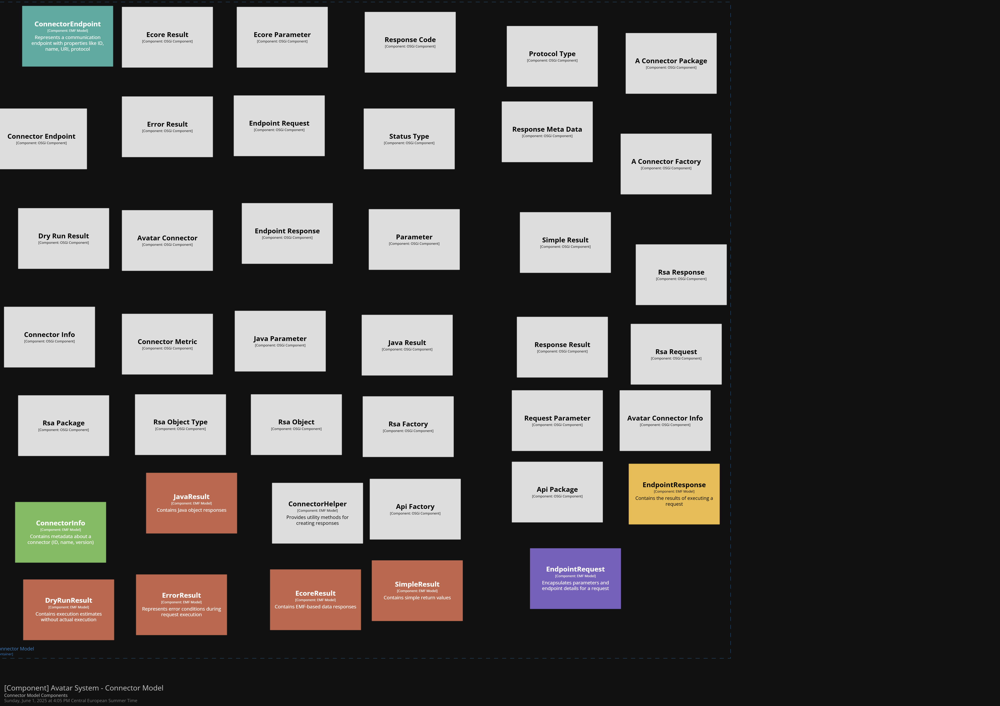

# Component Finding Strategy

We aim to implement the following strategy:

- **Find all types annotated with the OSGi `@Component` annotation.**
- **Find all types whose names match the `.*Whiteboard|result|info.*` regular expression.**
- **Find all types whose names end with `Whiteboard`, `result`, or `info`.**

> **Implementing a custom strategy**

> We can’t use interfaces (apparently they aren’t supported as a strategy in the new component finder).

I discovered that we can’t use two strategies that identify the same component, as it throws an exception. We need to find a workaround for this.

---

## Problem

We want to scan the entire `src` directory, but we face several challenges:

### 1. Unnecessary Entities

- When scanning for entities, we end up including every entity in the project—even those we don’t need.
- Since OSGi organizes code into bundles, we can scan each bundle individually to limit the scope.

### 2. Cross‐Bundle Components

- A component defined in one bundle should sometimes be in the same container as a component defined in another bundle.
- How can we express “give me both of these components” when they exist in different bundles?

### 3. Finding `ConnectorImpl` Implementations

- One approach is to read each `ConnectorImpl` class’s annotation value:
  - Every connector is a component annotated with `@Connect("…")`.
  - We would need to use reflection to discover those annotation values at runtime.
- As a workaround, enforce a naming convention: every class implementing `ConnectorImpl` must end with `ConnectorImpl`.
  - With a suffix rule (`*ConnectorImpl`), we can locate them as components without relying on annotations.

> **Note:** Relationships between components are currently configured manually. We hope to automate this in the future.

---

## Components and How I Found Them

### `ModelContainer`

The idea now is to find all models using an `AnnotationStrategy`, because every model has (and will have) the `@ProviderType` annotation. This works well.



```java
// Function to find all components in the model using OSGi annotations.
// We could also filter by regex to find only specific types (e.g., results),
// but this also picks up models we don’t need (like RSA factory classes in the EMF model).
// The advantage is that it finds every model in the package.
// This strategy works because only the models have the @ProviderType annotation,
// so all future models should include this annotation.

private static void scanAllModelsByProviderType(Container container, File path) {
    try {
        // Build a finder for classes annotated with @ProviderType.
        ComponentFinder finder = new ComponentFinderBuilder()
            .forContainer(container)
            .fromClasses(path) // path → directory or JAR of compiled classes
            .withStrategy(
                new ComponentFinderStrategyBuilder()
                    .matchedBy(
                        new AnnotationTypeMatcher(
                            "org.osgi.annotation.versioning.ProviderType"
                        )
                    )
                    .withTechnology("OSGi Component")
                    .forEach(component -> {
                        component.setTechnology("EMF Model");
                        if (component.getName().contains("ConnectorInfo")) {
                            component.addTags("Info");
                        } else if (component.getName().contains("EndpointRequest")) {
                            component.addTags("Request");
                        } else if (component.getName().contains("EndpointResponse")) {
                            component.addTags("Response");
                        } else if (component.getName().contains("DryRunResult") 
                                   || component.getName().contains("ErrorResult")) {
                            component.addTags("Result");
                        } else if (component.getName().contains("ConnectorEndpoint")) {
                            component.addTags("Endpoint");
                        } else if (component.getName().contains("Package")) {
                            component.addTags("Package");
                        } else if (component.getName().contains("Serializer")) {
                            component.addTags("Infrastructure");
                        } else if (component.getName().contains("Connector")) {
                            component.addTags("Implementation");
                        } else if (component.getName().contains("Parameter")) {
                            component.addTags("Parameter");
                        } else if (component.getName().contains("Result")) {
                            component.addTags("Result");
                        } else if (component.getName().contains("Factory")) {
                            component.addTags("Factory");
                        } else if (component.getName().contains("Metric")) {
                            component.addTags("Metric");
                        } else if (component.getName().contains("Type")) {
                            component.addTags("Type");
                        } else if (component.getName().contains("Helper")) {
                            component.addTags("Helper");
                        } else {
                            System.out.println(
                                "Component " + component.getName() + " does not match any known tags"
                            );
                        }

                        System.out.println(
                            "Found OSGi component: " + component.getName()
                        );
                    })
                    .build()
            )
            .build();

        finder.run();
        System.out.println("Successfully found OSGi components");
    } catch (Exception e) {
        System.out.println("No OSGi components found → " + e.getMessage());
    }
}
```

### Identifying `ConnectorImpl` Container

```java
// Idea: Scan the bundle to find all connectors. One way to automate this is:
//   • Find OSGi components with the @Component annotation and a property "connector" set to true.
//     This would discover all connectors in the bundle → not sure if this is possible.
//   • As a workaround, scan the bundle (not the entire src folder) and find OSGi components by @Component.

private static void scanConnectorsByOsgiComponentAnnotation(Container container, File path) {
    try {
        ComponentFinder finder = new ComponentFinderBuilder()
            .forContainer(container)
            .fromClasses(path)
            .withStrategy(
                new ComponentFinderStrategyBuilder()
                    .matchedBy(
                        new AnnotationTypeMatcher(
                            "org.osgi.service.component.annotations.Component"
                        )
                    )
                    .withTechnology("OSGi Component")
                    .forEach(component -> {
                        component.addTags("Implementation");
                        component.setTechnology("Java/OSGi");
                        if (component.getName().contains("ISMA")) {
                            component.setDescription("Implementation for the ISMA HIMSA protocol");
                        } else if (component.getName().contains("HL7")) {
                            component.setDescription("Implementation for the HL7 healthcare standard");
                        }
                        System.out.println("Found OSGi component: " + component.getName());
                    })
                    .build()
            )
            .build();

        finder.run();
        System.out.println("Successfully found OSGi components");
    } catch (Exception e) {
        System.out.println("No OSGi components found → " + e.getMessage());
    }
}
```

That approach also relies on annotations.

#### Workaround

As a workaround, enforce a naming convention: every new class implementing `ConnectorImpl` must end with `ConnectorImpl`.
With a suffix rule (`*ConnectorImpl`), we can locate them as components without relying on annotations.

```java
private static void scanConnectorsByNameSuffix(Container container, File path) {
    try {
        // Build a strategy that matches classes whose names end with "ConnectorImpl".
        ComponentFinder finder = new ComponentFinderBuilder()
            .forContainer(container)
            .fromClasses(path)
            .withStrategy(
                new ComponentFinderStrategyBuilder()
                    .matchedBy(new NameSuffixTypeMatcher("ConnectorImpl"))
                    .withTechnology("NameSuffix ConnectorImpl")
                    .forEach(component -> {
                        System.out.println("→ (STRAT 2) Found .*ConnectorImpl.*: " + component.getName());
                    })
                    .build()
            )
            .build();

        finder.run();
        System.out.println("Successfully found ConnectorImpl components");
    } catch (Exception e) {
        System.out.println("No matching components found — " + e.getMessage());
    }
}
```

I discovered that we cannot combine two strategies if they match the same component—it throws an exception. We need to filter the results to avoid overlapping matches.

---
