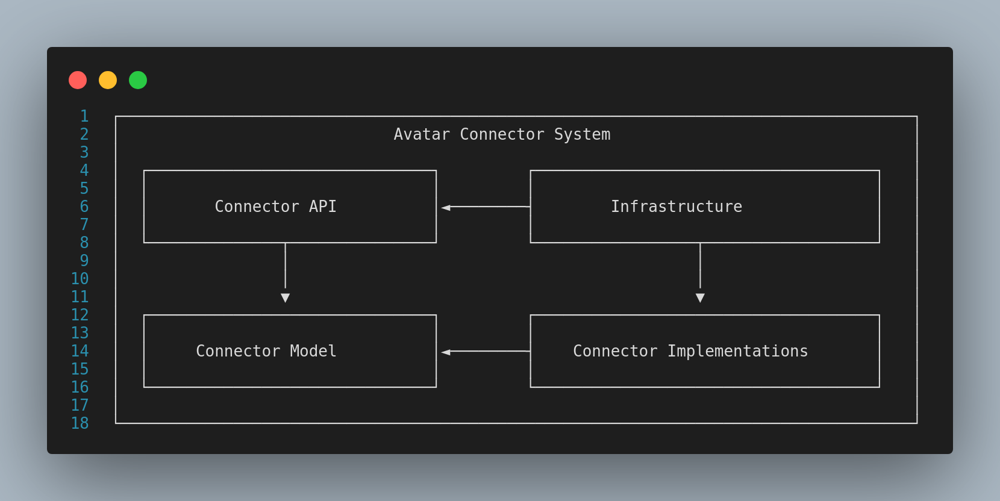
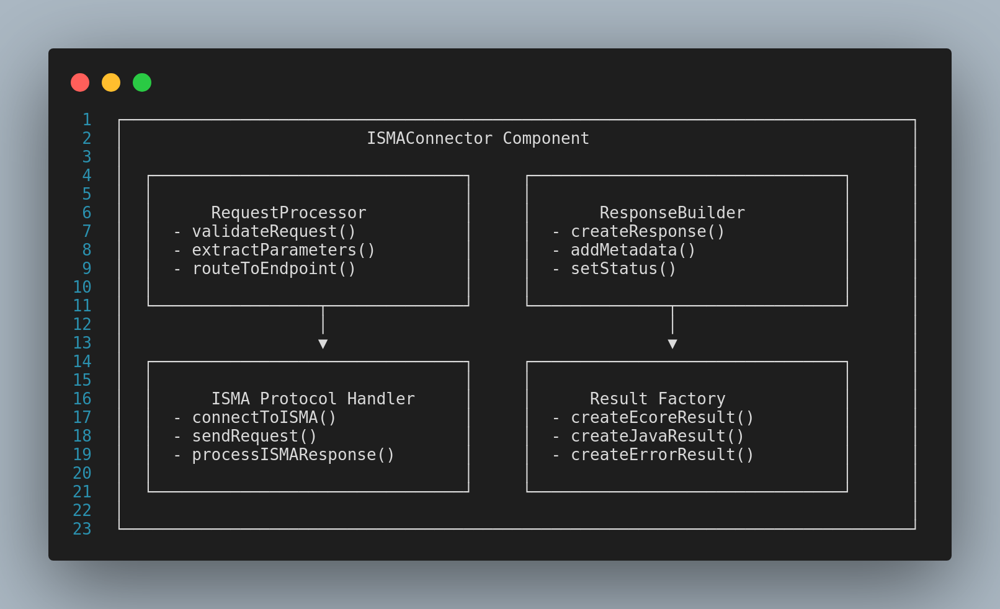

# C4 Model Structure for Avatar

## Level 1: Context Diagram

## Level 2: Container Diagram

## Level 3: Component Diagram - EMF Model Repository

## Level 3: Component Diagram - Connector API

## Level 3: Component Diagram - Implementation Components

## Level 3: Component Diagram - Infrastructure Components

## Level 4: Component Detail - Connector Implementation

## Flow Representations to Add

- Request/Response flow  
- Service Discovery process  
- Remote Communication patterns  

---

This approach gives you a comprehensive **C4 model** that captures the modular **OSGi architecture** of the Avatar system while highlighting its key **functional components** and **relationships**.