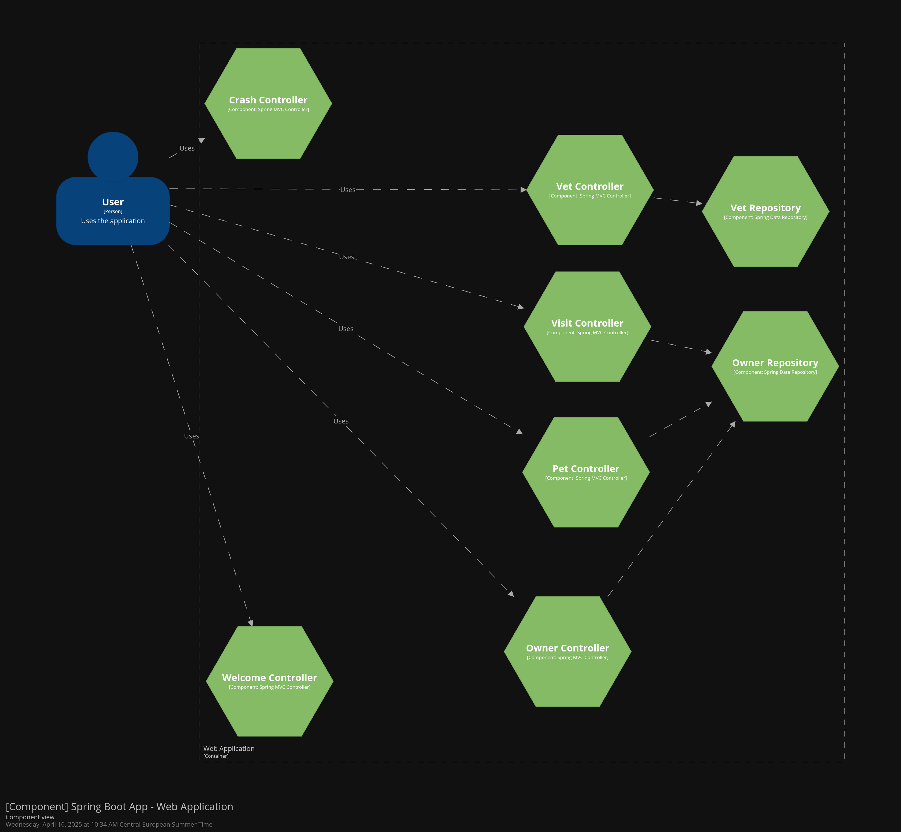
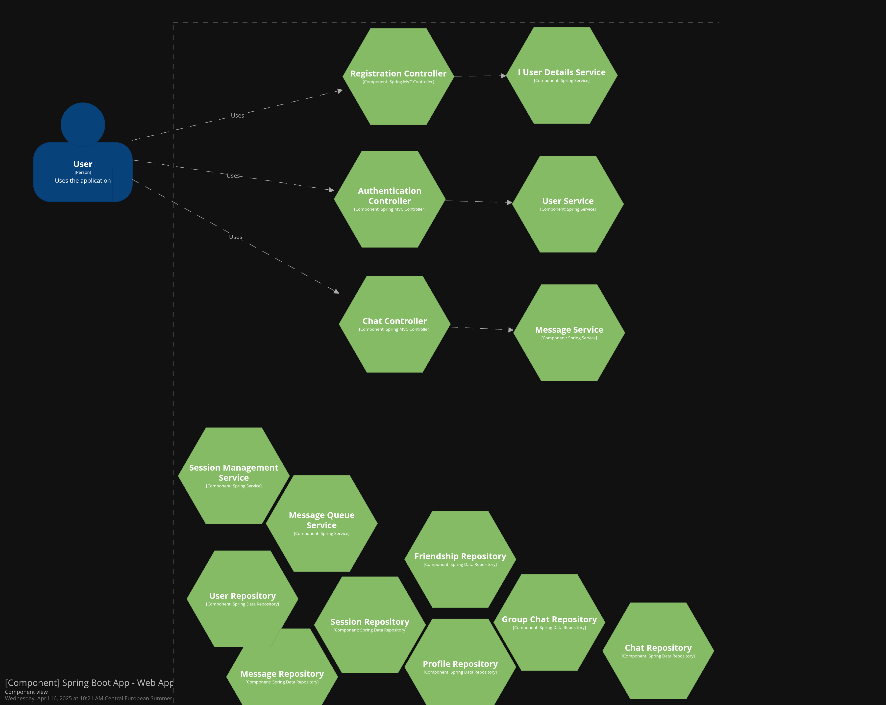

#Structurizr Component Finder in Java am Beispiel „BetClinic“

## Was ist der Structurizr Component Finder?

Der **Component Finder** ist ein Modul der [Structurizr for Java](https://docs.structurizr.com/java/component/introduction) Bibliothek, das automatisch Softwarekomponenten in einer Codebasis erkennt und daraus ein **C4-Komponentenmodell (Level 3)** generiert. Es analysiert bestehende Klassen, Interfaces und Abhängigkeiten anhand von Annotations, Namensmustern, Vererbung oder anderen Heuristiken.

---

## Beispiel: PetClinic

In einem Java-Projekt wie **PetClinic** kann man den Component Finder verwenden, um automatisch die wichtigsten Komponenten im Anwendungscode zu identifizieren.

### Wichtige Codeausschnitte(com.structurizr.component)

```java
ComponentFinder componentFinder = new ComponentFinderBuilder()
    .forContainer(webApp)
    .fromClasses(new File(".../spring-petclinic"))
    .withStrategy(
        new ComponentFinderStrategyBuilder()
            // just one matchby example just demonstration
            .matchedBy(new RegexTypeMatcher("^.*Controller$"))
            .matchedBy(new ExtendsTypeMatcher("org.springframework.web.servlet.mvc.Controller"))
            .matchedBy(new AnnotationTypeMatcher("org.springframework.stereotype.Controller"))
            .withTechnology("Spring MVC Controller")
            .forEach(component -> {
                user.uses(component, "Uses");
                component.addTags(component.getTechnology());
            })
            .build()
    )
    .withStrategy(
        new ComponentFinderStrategyBuilder()
            .matchedBy(new NameSuffixTypeMatcher("Repository"))
            .withTechnology("Spring Data Repository")
            .forEach(component -> {
                component.addTags(component.getTechnology());
            })
            .build()
    )
    .build();
componentFinder.run();
```

Diese Kombination erkennt Controller-Klassen, Repositorys sowie Spring-Komponenten über Annotationen, Namensmuster und Vererbung.

---

## Component finder strategies (structurizr.analysis.*)

>  **Kommentar:** Dieser Abschnitt gibt einen hilfreichen Überblick über die verfügbaren Component Finder Strategien in den Structurizr Java-Erweiterungen. Es wird klar zwischen Strategien unterschieden, die auf statischer Analyse des kompilierten Bytecodes basieren, und solchen, die den Quellcode analysieren. Besonders nützlich ist der Hinweis, dass man dank der Open-Source-Struktur auch eigene Strategien implementieren kann.

> **Kommentar:** Structurizr zwei verschiedene Pakete zur Komponentenerkennung bereitstellt: `com.structurizr.analysis.*` und `com.structurizr.component.*`. Letzteres wurde mit Version 4.0.0 eingeführt und stellt eine modernisierte und flexiblere Alternative dar. Obwohl in der Dokumentation hauptsächlich `com.structurizr.component.*` verwendet wird, kann auch das ältere `analysis`-Paket weiterhin für die Erstellung von C4-Modellen eingesetzt werden.
[source](https://github.com/structurizr/java/tree/master/structurizr-component)


| Name | Dependency | Description | Extracted from |
|------|------------|-------------|----------------|
| TypeMatcherComponentFinderStrategy | structurizr-core | A component finder strategy that uses type information to find components, based upon a number of pluggable TypeMatcher implementations (e.g. **NameSuffixTypeMatcher**, **ImplementsInterfaceTypeMatcher**, **RegexTypeMatcher** and **AnnotationTypeMatcher**). | Compiled bytecode |
| SpringComponentFinderStrategy | structurizr-spring | Finds types annotated `@Controller`, `@RestController`, `@Component`, `@Service` and `@Repository`, plus classes that extend `JpaRepository`. | Compiled bytecode |
| StructurizrAnnotationsComponentFinderStrategy | structurizr-core | Finds the Structurizr annotations `@Component`, `@UsedByPerson`, `@UsedBySoftwareSystem`, `@UsedByContainer`, `@UsesSoftwareSystem`, `@UsesContainer` and `@UsesComponent`. | Compiled bytecode |
| SourceCodeComponentFinderStrategy | structurizr-core | This component finder strategy doesn't really find components, it instead extracts the top-level Javadoc comment from the code so that this can be added to existing component definitions. It also calculates the size of components, based upon the number of lines of source code. | Source code |

Diese Strategien lassen sich kombinieren, um eine präzise Komponenten-Erkennung zu ermöglichen.

[source](https://github.com/structurizr/java-extensions/blob/master/docs/component-finder.md)

---

## Vorteile

- **Automatisierung** spart Zeit und Aufwand.
- **Flexible Kombination** der Strategien für genaues Matching.
- **Aktuelle Architektur-Dokumentation** direkt aus dem Code.
- **CI/CD-freundlich** und buildbar.
- **Granulare Visualisierung** der Komponentenebene (Level 3).

---

## Nachteile

- **Nur für Java/C#** geeignet.
- **Erfordert strukturierte Codebasis** (Namenskonventionen, Annotationen etc.).
- **Begrenzte Strategieauswahl**, da noch in Entwicklung.
- **Skalierbarkeit**: Bei großen Projekten kann Modell unübersichtlich werden.
- **Mögliche Fehlklassifikationen** bei ungenauer Konfiguration.

---
## Erfahrung mit dem Structurizr Component Finder (`com.structurizr.component.*`)

Ich habe den Structurizr Component Finder in zwei Projekten getestet:  
einmal im bekannten **SpringPetClinic-Projekt** und einmal in einem noch nicht vollständig entwickelten Projekt – einem **Webchat-Server** auf Basis von Spring Boot.

### PetClinic:



### Chatserver:



---

###  Meine Erfahrung

Structurizr ist ein **sehr hilfreiches Tool**, um ein C4-Modell automatisch zu generieren, Komponenten zu erkennen und **Beziehungen zwischen Komponenten** (z. B. Controller ↔ Repository) zu identifizieren.  
Allerdings erfordert es **manuelle Vorarbeit**, um die besten Regeln zur Komponentenerkennung zu definieren.

---

### Empfohlene Vorgehensweise

Bevor ein automatisiertes C4-Modell erstellt wird, sollte man folgende Schritte durchführen:

1. **Komponenten identifizieren**  
   - Die Codebasis analysieren und verstehen  
   - Eine erste Vorstellung vom Endmodell gewinnen (z. B. mithilfe eines UML-Diagramms)

2. **Komponenten kategorisieren**  
   - Ähnliche Komponenten gruppieren, z. B.:
     - `Web-Controller`
     - `Daten-Repositories`
     - `Services`

3. **Regeln zur Komponentenerkennung definieren**  
   - Für jede Kategorie passende Regeln festlegen:
     - z. B. Klassen mit `@Controller` → Web-Komponente
     - Klassen mit Suffix `Repository` → Datenzugriff
     - Oder per Annotation, Interface, Paketstruktur etc.

---

### Wichtiger Hinweis

Jede Codebasis ist **individuell**, daher ist es **nicht möglich**, ein vollständiges C4-Modell für alle Klassen vollautomatisch zu generieren.  
Structurizr kann viele Beziehungen erkennen – **aber nicht alle**.  

Das sieht man auch in meiner Modellierung des **Chatserver-Projekts**:  
Die Beziehung zwischen den `Repository`- und `Service`-Klassen wurde **nicht automatisch erkannt**.

**Das Petclinic-Beispiel wurde gut modelliert, da es sich um ein einfaches Projekt handelt**


**Manuelle Ergänzungen durch Entwickler sind notwendig**, besonders bei komplexen oder indirekten Abhängigkeiten.


---

### Was erkennt der `ComponentFinder`?

Der `ComponentFinder` erkennt **keine expliziten Beziehungen** (wie `uses(...)`) zwischen Komponenten.  
Stattdessen erkennt er **Verbindungen zwischen Klassen**, also welche Klassen andere verwenden – z. B. wenn ein `Controller` ein `Repository` über den Konstruktor oder ein Feld nutzt.

Diese Verbindungen werden intern als **referenzierte Typen (`referencedTypes`)** gespeichert.  
Wenn sowohl die Quell- als auch die Zielklasse als **Komponenten erkannt** wurden, kann man daraus **manuell `uses(...)`-Beziehungen** erzeugen.

Das bedeutet: Wenn der `ComponentFinder` eine Klasse als Komponente erkennt (z. B. einen Controller), analysiert er zusätzlich, **welche anderen Klassen von dieser Komponente verwendet werden**.


## Wäre es sinnvoll, ein größeres Projekt zu implementieren und zu prüfen, ob ComponentFinder funktioniert und das C4‑Modell automatisch erstellt wird bzw. ob es nutzbar ist?

- Idee: Einen Microservice auswählen und testen, ob Structrizer funktioniert.
- Ein Spring‑Plugin verwenden, um C4‑Modelle zu erstellen.
- C4ibterflow mit Structrizer und dem Spring‑Plugin vergleichen 


Vorteile der Verwendung des Component Finder bei groß angelegten Architekturen:

- Zeit- und Arbeitsersparnis: Automatisierte Erkennung von Komponenten reduziert manuellen Aufwand.

- Skalierbarkeit und Abdeckung: Auch komplexe Systeme mit vielen Klassen und Modulen können effizient erfasst werden.

- Konsistenz und Standardisierung: Einheitliche Darstellung und Dokumentation der Architekturkomponenten.

- Aktualität: Die Architektur bleibt durch automatische Aktualisierungen stets auf dem neuesten Stand.


### Einschränkungen und Herausforderungen der automatisierten Component-Finder-Nutzung

> Die automatische Erkennung funktioniert nur so gut, wie die Regeln, die man vorher eingestellt hat.  
> Wenn der Programmcode keine typischen Muster verwendet, kann es passieren, dass der Component Finder wichtige Teile übersieht oder unwichtige Klassen fälschlicherweise als wichtige Komponenten erkennt.

Damit die Ergebnisse wirklich genau sind, muss man oft die Einstellungen anpassen – zum Beispiel die Namensregeln überarbeiten oder eigene Filter hinzufügen.  
Jede Codebasis ist anders, deshalb gibt es keine Regel, die für alle Projekte perfekt passt.

---

> **Handling of Custom Frameworks or Dynamic Behavior:**  
> Dynamic dependency injection that isn’t visible via static analysis – the tool may not detect those components or relationships.

**Umgang mit eigenen Frameworks oder dynamischem Verhalten:**  
Wenn Abhängigkeiten (z. B. welche Klassen andere benutzen) erst **zur Laufzeit** festgelegt werden und **nicht direkt im Code sichtbar** sind,  
kann das Analyse-Werkzeug diese Verbindungen oder Bausteine **nicht erkennen**.

---

**Beispiel:**

> Only classes that meet the explicit matching criteria will be captured – so components instantiated via reflection or added at runtime could be missed.  
> If you’re using a framework that the tool doesn’t have a preset strategy for (e.g. a non-Spring IoC framework or Java EE annotations), you’ll need to create custom strategies or manually annotate the code.

Nur Klassen, die **genau den festgelegten Regeln** entsprechen, werden erkannt.  
Das bedeutet: Wenn eine Klasse **erst zur Laufzeit erstellt wird** (z. B. über Reflection) oder **nicht direkt im Code sichtbar ist**, kann das Werkzeug sie **übersehen**.

Wenn du ein Framework benutzt, das das Werkzeug **nicht automatisch erkennt** (z. B. ein anderes als Spring oder spezielle Java EE-Anmerkungen), musst du:

- **eigene Regeln festlegen** (also dem Tool beibringen, wie es das Framework erkennen soll),
- oder den **Code manuell mit Anmerkungen versehen**, damit das Werkzeug die wichtigen Teile findet.

---

**Beispiel:**

> Integrations between microservices are a special case:  
> Static code analysis might not know that Service A calls Service B’s API unless the code explicitly references it (e.g. via an HTTP client class).  
> Often, cross-service usage is configured via URLs or service discovery, which the Component Finder cannot infer.  
> Capturing these inter-service relationships may require manually adding relationships or using Structurizr’s annotations (e.g. an annotation in code to denote “uses Service B”) – otherwise, the automated model could omit some external interactions.

**Verbindungen zwischen Microservices sind ein besonderer Fall:**  
Die statische Code-Analyse erkennt **nicht automatisch**, dass **Service A den Service B benutzt**, wenn das nicht **direkt im Code steht** (z. B. durch eine HTTP-Client-Klasse).

Oft werden solche Verbindungen über **URLs** oder **Service Discovery** eingerichtet – das kann das Werkzeug **nicht von selbst herausfinden**.

Damit solche Verbindungen trotzdem im Modell erscheinen, muss man:

- sie **von Hand hinzufügen**,
- oder den **Code mit einer speziellen Anmerkung markieren** (z. B. „verwendet Service B“).

Wenn man das nicht macht, **könnten wichtige Verbindungen im Modell fehlen**.

---

> Auto‑generated diagrams are fantastic, but curation—deciding what to leave out—is what turns them into clear architectural communication instead of an illegible code dump.  
> //// treat only @Service & @Controller as components

**Automatisch erzeugte Diagramme sind super,**  
aber erst die **Auswahl**, also **was man weglässt**,  
macht daraus eine **klare und verständliche Architekturübersicht** –  
und keinen **unlesbaren Codehaufen**.

Nur Klassen mit `@Service` und `@Controller` sollen dabei als **echte Komponenten** behandelt werden.

---

### Zusammenfassend

Automatisch erzeugte Diagramme sind besonders nützlich,  
um eine **aktuelle und vollständige Dokumentation** eines großen Systems mit **wenig Aufwand** zu gewährleisten.

Manuell erstellte Diagramme bieten dagegen die Möglichkeit,  
**genau zu steuern**, welche Informationen gezeigt werden –  
allerdings besteht das Risiko, dass sie **veraltet oder ungenau** werden.

In einer großen Microservice-Architektur ist ein **rein manueller Ansatz** oft nicht praktikabel,  
außer für sehr **grobe Übersichten**.

Ein **vollautomatischer Ansatz** kann dagegen **überfordern**,  
wenn man nicht gezielt **filtert und aufräumt**.

**Deshalb ist eine Mischstrategie sinnvoll:**  
Sie **verbindet die Vorteile beider Methoden** – automatisch und aktuell, aber dennoch klar und verständlich.

**Wie das konkret aussehen kann, besprechen wir im nächsten Abschnitt.**

---
sloution : 

> Use Automation for the Baseline, then Refine Manually: Let the Structurizr Component Finder do the heavy lifting by initially populating the model from code. This gives you a thorough baseline of containers, components, and their interconnections. Next, invest time in manual refinement: add any missing context (descriptions, external dependencies, etc.) and remove or de-emphasize extraneous details. For instance, after using the Spring finder, you might attach meaningful descriptions to each component (since the code annotations won’t supply descriptions)​
codecentric.de. You might also decide to hide certain utility components that aren’t architecturally significant. The automated output should be the starting point, not the final product – review and adjust it so the diagrams communicate effectively. In practice, teams often iterate: generate, review, and tweak the model (maybe adjusting finder rules or post-processing the model) until the diagrams align with what architects want to convey.

> Know When to Rely on Automation vs. Manual Effort: Not every aspect of the architecture needs to be generated from code. Assess the parts of your system that change frequently and are tedious to document manually. 
nternal component structures of dozens of services fit this description (they evolve with code, and manual updates would be onerous), so automate those
. On the other hand, high-level relationships and conceptual views might be better crafted manually.

example : 
For example, defining the set of software systems and high-level containers in your enterprise, or illustrating an abstract data flow, could be done manually since they benefit from human design and don’t change as often


>Hybrid Modeling Approach:
mbrace a hybrid approach where automated and manual modeling co-exist. You might automatically generate each microservice’s component list, but still manually define the interactions between microservices. For instance, use Component Finder inside each container to find its components, but manually add the relationships between Containers (since you know service A calls service B’s API, even if that isn’t obvious via code)


- Structurizer suggests to have a separate workspace.dsl file per software system which extends from the overall landscape workspace defintion.


## make the C4 diagrams “self‑updating” whenever a new Spring @Controller (or @RestController) is introduced  ?

yes : The combination of Structurizr DSL + Component Finder + CI pipeline will automatically rescan the freshly–compiled classes, detect the new controller via the SpringRestControllerComponentFinderStrategy, and push an updated workspace to Structurizr Cloud/Lite.

Compilation before scan – the CLI must run after the microservice is built; otherwise new classes aren’t on the classpath and won’t be found.

Naming & annotations drive discovery – if your team occasionally forgets the Spring annotation or uses something custom (e.g., @GraphQLController), you’ll either need an extra custom finder strategy or ask devs to add a Structurizr annotation (e.g., @Component) themselves.

## Fazit

Der **Structurizr Component Finder** ist ein nützliches Tool zur teilautomatisierten Erstellung von C4-Komponentenmodellen aus Java-Code. Dank vielfältiger Strategien wie Annotation-, Regex- und Vererbungs-Matching lassen sich relevante Klassen effizient identifizieren. Für große und komplexe Projekte ist dennoch eine manuelle Ergänzung empfehlenswert.
